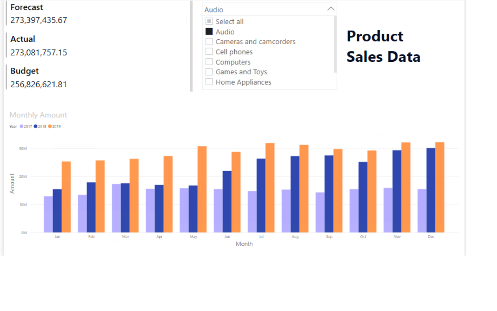

# 📊 Interactive Power BI Sales Report

  

> [!NOTE] 
> This project is based on guided exercises from DataCamp’s *Introduction to Power BI* course and is shared for educational and portfolio purposes only. All course materials and underlying datasets are the property of their respective owners.

 

## Overview
This project showcases my previous **Power BI dashboards** created as part of the *DataCamp – Introduction to Power BI* course. The report focuses on visualizing product sales trends and demonstrates how Power BI can be used for business insight and data storytelling.

## What I Learned
- Navigating the **Power BI interface**, including:
  - Report, Data, and Model views  
  - Canvas design and layout  
  - Using the three main panes: **Filters, Visualizations, and Data Panes**
- Creating and formatting charts and KPI visuals  
- Using slicers for interactive filtering, drilling-down visual, and hierarchies  

## Dataset
The dataset used in this project was provided within the DataCamp learning environment.  
Due to access limitations, the dataset is **not included** in this repository.  
This repository instead focuses on the **final dashboard output and learned concepts**.

## Tools Used
- **Power BI Desktop**
- DataCamp Learning Environment

## Resources
- DataCamp: https://www.datacamp.com  
- Power BI Introduction Course: https://www.datacamp.com/courses/introduction-to-power-bi  