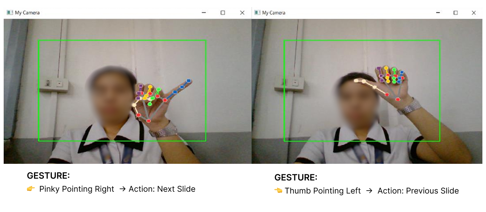
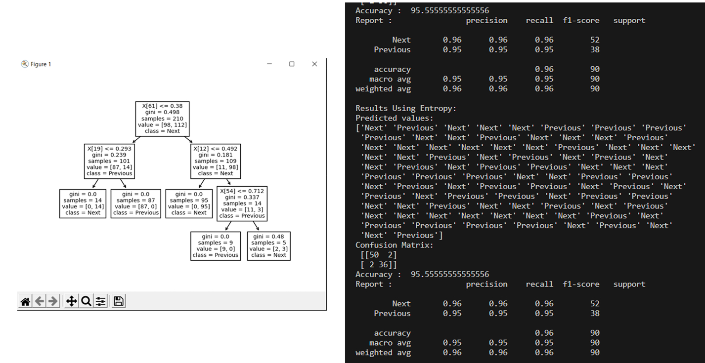

# 🤖 Hand Gesture Recognition System

<p align="center">
  
</p>

## Overview
This project implements a **hand gesture recognition system** using computer vision and machine learning. It detects and classifies hand gestures from a live webcam feed and demonstrates how human gestures can be translated into actionable inputs for **intelligent agent workflows**.

The project focuses on real-time interaction, serving as a foundation for gesture-based human–computer interaction systems.

## Objective
To develop a real-time hand gesture recognition system that interprets webcam input and classifies hand gestures using machine learning techniques.

## Features
- Real-time webcam-based hand gesture detection  
- Machine learning–based gesture classification  
- Modular Python code for data handling, training, and inference  
- Sample training dataset included for reproducibility  

## Model Training & Evaluation
<p align="center">  </p>

## Training Process
- Loaded and explored the annotated dataset from trainingdata.csv using Pandas
- Split the dataset into training and testing sets
- Trained two Decision Tree classifiers using: 
    - Gini Index 
    - Entropy
- Visualized the trained decision tree for interpretability
- Evaluated performance using:
    - Confusion matrix
    - Accuracy score
    - Precision, recall, and F1-score

## Results Summary
- **Overall Accuracy:** ~95.6%
- Both Gini and Entropy-based models showed strong and consistent performance
- Balanced precision and recall across gesture classes
- The trained model was successfully integrated into the main application for real-time inference

---
 
## Installation
1️⃣ Clone the Repository
```bash
git clone https://github.com/yourname/yourrepo.git
cd hand-gesture-recognition 
```
2️⃣ Install Dependencies
```bash
pip install -r requirements.txt
```
3️⃣ Train the Model
```bash
python training.py
```
This step trains the Decision Tree model using the dataset and evaluates its performance.

4️⃣ Run the Application
```bash
python mainapp.py
```
Use your webcam to perform gestures and observe real-time predictions.

## Gesture-to-Action Mapping

| Gesture | Action |
|--------|--------|
| Pinky pointing right | Next slide |
| Thumb pointing left | Previous slide |

## Use Cases
- Gesture-based presentation control
- Touchless human–computer interaction
- Assistive and accessibility tools