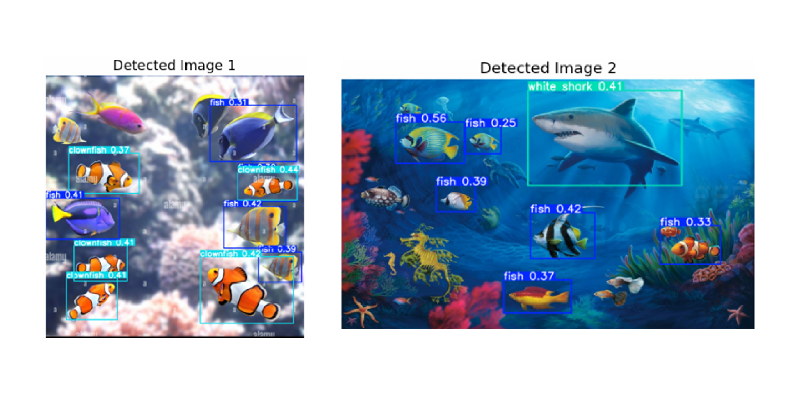

# Sea Animal Image Classification (YOLOv5)

  

## Objective
To build an object detection system capable of recognizing and localizing sea animals in images, demonstrating the practical application of deep learning for computer vision and environmental monitoring use cases.

---

## Dataset
The dataset consists of annotated images of various sea animals used for training and validation.

- Manual image annotation using **LabelImg**
- Annotation format: **YOLO (.txt)**
- Data split: **80% training / 20% validation**
- Classes include fish, clownfish, turtles, and white sharks

📁 **Dataset Folder:**  
`./dataset/` — contains annotated images used during model training

---

## Approach
1. Annotated raw images using LabelImg and converted annotations to YOLO format  
2. Selected **YOLOv5** as the pre-trained object detection model  
3. Prepared the dataset by resizing, normalizing, and organizing images  
4. Trained the model using transfer learning with YOLOv5 pre-trained weights  
5. Evaluated performance using loss metrics, precision, recall, and mAP  
6. Fine-tuned the model by adding more diverse annotated samples and retraining  

---

## Model / Tools
- **Model:** YOLOv5 (YOLOv5s pre-trained weights)  
- **Frameworks:** PyTorch, YOLOv5  
- **Libraries:** OpenCV, Matplotlib, Pandas  
- **Platform:** Google Colab  
- **Experiment Tracking:** Weights & Biases (W&B)  
- **Annotation Tool:** LabelImg  

---

## Results
- Training and validation losses steadily decreased, indicating effective learning  
- Improved detection accuracy across multiple sea animal classes after fine-tuning  
- Model successfully generated bounding boxes and class labels on unseen images  

📊 Metrics observed:
- Precision
- Recall
- mAP (mean Average Precision)

---

## Resources
- LabelImg: https://github.com/tzutalin/labelImg  
- YOLOv5: https://github.com/ultralytics/yolov5  
- Google Colab: https://colab.research.google.com  

---

## Key Takeaways
- Transfer learning with YOLOv5 significantly reduced training time  
- Dataset quality and class balance strongly impacted model accuracy  
- Adding more diverse annotated images improved generalization  
- Cloud-based tools like Google Colab helped overcome local resource limitations  

---

## Future Improvements
- Expand the dataset with more diverse and balanced samples  
- Apply data augmentation techniques to improve robustness  
- Experiment with larger YOLOv5 variants for higher accuracy  
